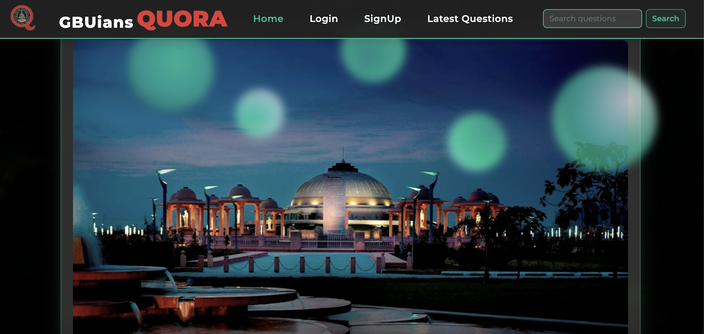
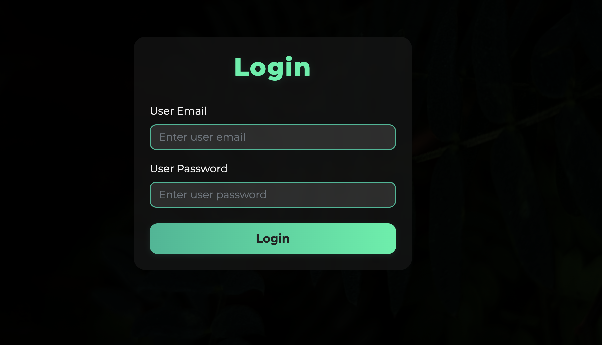
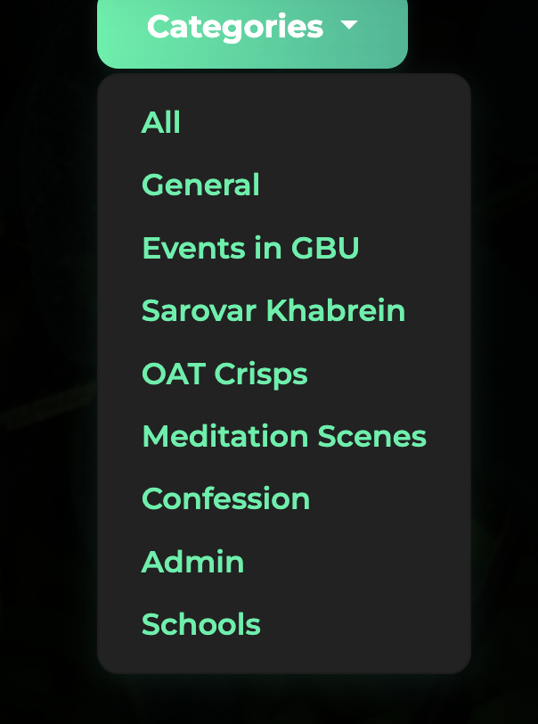
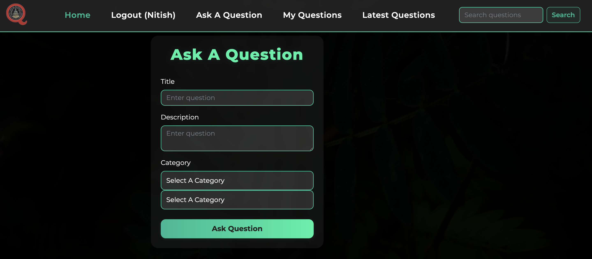
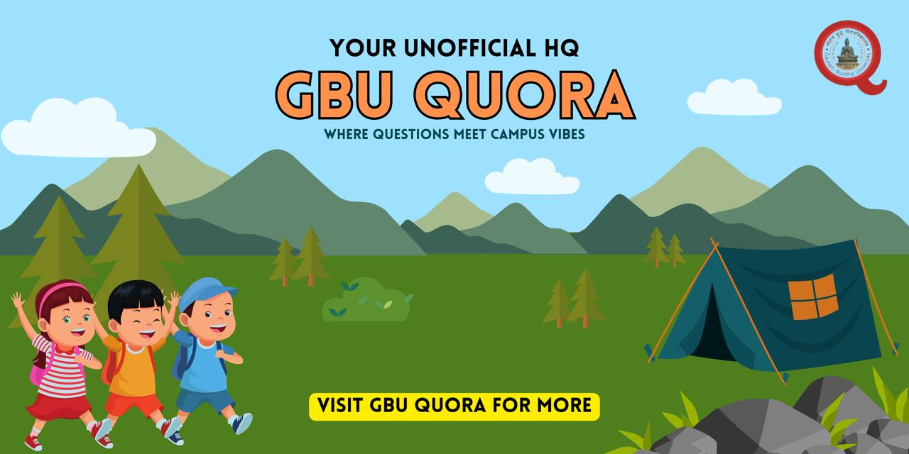

  

<h1 align="center">GBU QUORA</h1>

  <strong>Powered by Students, Driven by Curiosity</strong> 
  A Q&A discussion platform built for the students of <strong>Gautam Buddha University</strong>. 
  Discover answers, share knowledge, and connect with your GBU community.

  <a href="https://quoragbu.infinityfreeapp.com/GBU-QUORA/?i=1"><strong>🌐 Visit GBU Quora »</strong></a>

---

## 🚀 Features

- 🧠 Ask & Answer Questions
- 🎯 Student-Centric Categories
- 🔍 Real-time Search & Filtering
- 💬 Commenting System
- 📱 Mobile-Responsive Design

---

## 🛠️ Tech Stack

- **Frontend:** HTML, CSS, JavaScript
- **Backend:** PHP
- **Database:** MySQL
- **Hosting:** InfinityFree

---

## 📸 UI Screenshots

  
  
  
  

> ✨ *A glimpse into the smooth, student-focused interface of GBU Quora.*

---

## 🤝 Contributing

Contributions are welcome!  
Feel free to fork the repository, open issues, and submit pull requests to improve the platform together.

---

## 📬 Contact

Created with ❤️ by students of **Gautam Buddha University**.  
For queries, feedback, or collaboration:  
📧 **nitish.sheoran@studentambassadors.com**

---

 
  

